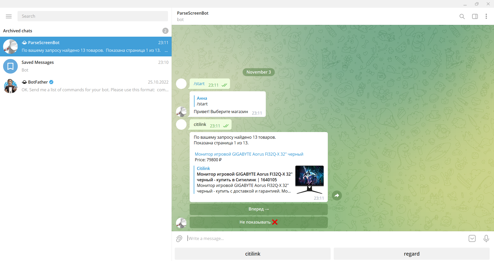

# TelegramBotApi
Телеграмм бот умеет:
- отслеживать товары нескольких интернет-магазинов.
- парсить отфильтрованные товары и отображать краткую информацию о товаре. 
- добавлять в черный список товар, чтобы больше его не отслеживать.
##  Поддержка Telegram API
Поддерживаются все типы и методы [Telegram Bot API 6.2](https://core.telegram.org/bots/api)
## Пример бота
